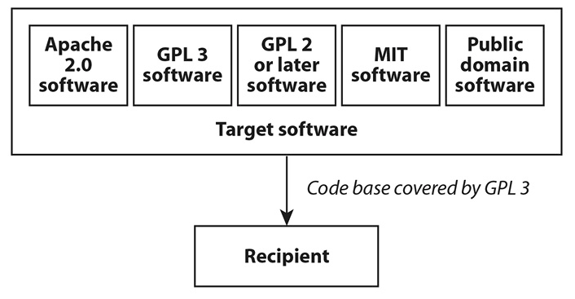

# Using Open Source Software

<!--markdownlint-disable MD035-->

---

## Question

What is open source software?

---

## Algorithm

>"A procedure for solving a mathematical problem [...] in a finite number of steps that frequently involves repetition of an operation"
>
>**Broadly**: "A step-by-step procedure for solving a problem or accomplishing some end"[^fn]

[^fn]: https://www.merriam-webster.com/dictionary/algorithm

------

## Source Code

>Source code is the version of a computer program as it is originally written (i.e., typed into a computer) by a human in a programming language.[^fn]

[^fn]:"http://www.linfo.org/object_code.html"

------

## Object Code

>Object code is the output of a compiler after it processes source code.[^fn]

[^fn]:"http://www.linfo.org/object_code.html"

------

## Software

>The programs and other operating information used by a  computer. (at runtime)

------

## Simplified View

---

## Copyright

>Copyright is the exclusive legal right to produce, reproduce, publish or perform an original literary, artistic, dramatic or musical work.

Source: [Canadian Intellectual Property Office - What is copyright?](https://www.ic.gc.ca/eic/site/cipointernet-internetopic.nsf/eng/wr03719.html?Open&wt_src=cipo-cpyrght-main)

See also [A guide to copyright](https://www.ic.gc.ca/eic/site/cipointernet-internetopic.nsf/eng/h_wr02281.html)

------

## Copyright & Licences

Software licences give you certain rights and conditions

---

## Open Source Software

>Software available under an open source licence.

For the purpose of the Government of Canada, we consider the Open Source Initiative's [definition](https://opensource.org/docs/definition.php) the current standard.

------

## Basic Rights

1. Use the software as you wish
2. Study the source code
3. Modify the source code
4. Redistribute the software

------

## Conditions

1. Notice
2. Derived works

------

## It's not open source

If you only have access to the source code.

_You **must** have the rights based on an open source licence._

---

## Types of Open Source Licences

Permissive:

>Allow you to do pretty much what you want with it and distribute it under different conditions than you obtained it.

------

## Types of Open Source Licences

Reciprocal:

>Allow you to do pretty much the same but require you to redistribute on the same conditions under which you obtained it.

---

## First Challenge

Choose an Open Source Licence:

* MIT License (Expat)
* Apache License 2.0 (Apache-2.0)
* BSD 3-Clause License (Revised)
* Mozilla Public License 2.0 (MPL-2.0)
* GNU General Public License v3 (GPL-3)
* GNU Affero General Public License v3 (AGPL-3.0)

Use [TL;DR Legal](https://tldrlegal.com)

Note:
* Find if it's a permissive or reciprocal licence
* Provide the main conditions under which you can use it

------

|Licence|Permissive|Reciprocal|
|---|:---:|:---:|
|MIT|X||
|Apache2.0|X||
|BSD-3|X||
|MPL-2.0||X|
|GPL 3.0||X|
|AGPL 3.0||X|

---

## Why bother?

---

## Second Challenge

Build a Web application that displays your name and the course title within the next 5 minutes on your local machine.

---

## Step by steps

TODO:

1. Create venv
1. Install packages
1. Run Django build
1. Update the view with name and 

---

## Why

It's in the Directive on Management of IT

------

* Don't start with a blank canvas, focus on the added value
* Speed up development time by reusing existing solutions to common problems
* Leverage a large community of peers to enhance quality and for wider maintenance
* Build on top of giants' shoulders and communities

------

>If you want to be at the top of the world, you have to start there.

Jeff McAffer, formerly Director of Microsoft's Open Source Program Office

---

## How

* Be secure
  * Know your dependencies 
  * Assess the components
  * Patch your stuff!

------

## Resources

* MITRE's [Common Vulnerabilities and Exposures (CVE)](https://cve.mitre.org/)
* [U.S. National Vulnerability Database (NVD)](https://nvd.nist.gov/)

------

## Tools

* JFrog X-Ray
* FOSSA
* Sonatype
* Synopsys
* Etc.

---

## How

* Be compliant
  * Know your dependencies
  * Comply with T&Cs of the licences

------

## Rights and Responsibilities

_Inbound_

vs

_Outbound_

------

The terms and conditions under which you will be distributing your software must not exceed the terms and conditions associated with the licences of the software you will be using in your project.

>"Say what?"

------

------

 

Heather Meeker, _Open (Source) for Business: A Practical Guide to Open Source Software Licensing_, 51-56.

------

Heather Meeker, _Open (Source) for Business: A Practical Guide to Open Source Software Licensing_, 51-56.

------

Heather Meeker, _Open (Source) for Business: A Practical Guide to Open Source Software Licensing_, 51-56.

---

## Third Challenge

Find the errors

>Clone projects

------

Error 1

Known security vulnerability

------

Error 2

Project online without an OSS licence

------

Error 3

Incompatible Licence

<!--markdownlint-enable MD035-->