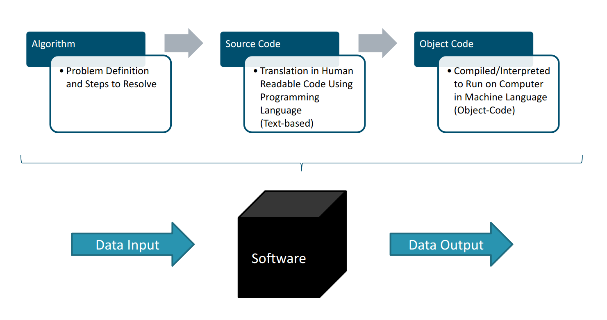
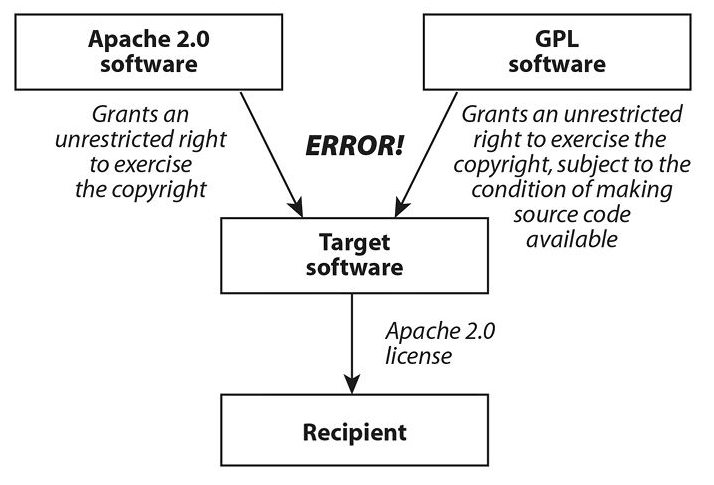

# Using Open Source Software

<!--markdownlint-disable MD035-->

---

## Question

What is it Software?

---

## Algorithm

> "A procedure for solving a mathematical problem [...] in a finite number of steps that frequently involves repetition of an operation"
>
> **Broadly**: "A step-by-step procedure for solving a problem or accomplishing some end"[^fn]

[^fn]: https://www.merriam-webster.com/dictionary/algorithm

------

## Source Code

> Source code is the version of a computer program as it is originally written (i.e., typed into a computer) by a human in a programming language.[^fn]

[^fn]:"http://www.linfo.org/object_code.html"

------

## Object Code

> Object code is the output of a compiler after it processes source code.[^fn]

[^fn]:"http://www.linfo.org/object_code.html"

------

## Software

> The programs and other operating information used by a computer. (runtime)

------

## Simplified View

---

[What is intellectual property?](https://canadabusiness.ca/government/copyright-and-intellectual-property/what-is-intellectual-property/)

Intellectual Property is the legal right to ideas, inventions and creations in the industrial, scientific, literary and artistic fields. It also covers symbols, names, images, designs and models used in business. Without realizing it, your business may be creating IP assets that should be protected.

---

## Open Source Software

>Software available under an open source license.

For the purpose of the Government of Canada, we consider the Open Source Initiative's [definition](https://opensource.org/docs/definition.php) of open source as an industry standard.

------

## It's not open source

If you only have access to the source code.

_You **must** have the rights based on the open source definition._

------

Right to:

1. Use the software as you wish
2. Study the source code
3. Modify the source code
4. Distribute the software

---

## Legal Dimension

>An open source license is the owner of IP granting you certain rights under specific terms and conditions.

------

## Types of Licenses

Permissive:

>Allow you to do pretty much what you want with it and distribute it under different conditions than you received.

Reciprocal:

>Allow you to do pretty much the same but require you to redistribute on the same conditions under which you obtained it.

------

_Inbound_

vs

_Outbound_

------

The terms and conditions under which you will be distributing your software must not exceed the terms and conditions associated with the licences of the software you will be using in your project.

>"Say what?"

------

------

 

Heather Meeker, _Open (Source) for Business: A Practical Guide to Open Source Software Licensing_, 51-56.

------

Heather Meeker, _Open (Source) for Business: A Practical Guide to Open Source Software Licensing_, 51-56.

------

Heather Meeker, _Open (Source) for Business: A Practical Guide to Open Source Software Licensing_, 51-56.

------

------

## Resources

TL;DR Legal

---

## Intellectual Property

Note:
Test

------

## Security

<!--markdownlint-enable MD035-->